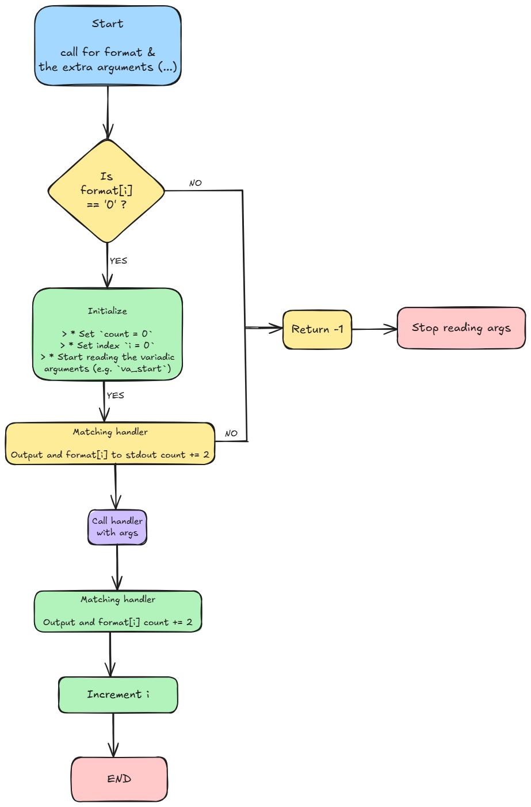

# Holbertonschool-Printf

Reimplementation of the C standard library `printf` function.

## Description

The `_printf` function produces output according to a format string
and a variable number of arguments. It handles the following conversion
specifiers:

- `%c` : character  
- `%s` : string  
- `%%` : percent sign  
- `%d`, `%i` : signed decimal integers  

All output is written to the standard output (file descriptor `1`), and
the function returns the total number of characters printed (excluding
the terminating null byte), or `-1` on error.

## Flowchart

The following flowchart shows the high-level logic of our `_printf`
implementation: how the format string is parsed, how specifiers are
dispatched to handlers, and how the total number of printed characters
is computed.



## Files

- `main.h` – header file with prototypes and struct definition  
- `_printf.c` – core implementation: parsing and dispatching specifiers  
- `handlers_char_str.c` – handlers for `%c`, `%s`, and `%%`  
- `handlers_int.c` – handler for `%d` and `%i`  
- `man_3_printf` – man page for `_printf`  
- `assets/printf_flowchart.png` – flowchart image shown above  

## Compilation

```bash
gcc -Wall -Werror -Wextra -pedantic -std=gnu89 -Wno-format -I. _printf.c handlers_char_str.c handlers_int.c tests/main.c -o printf_test

./printf_test